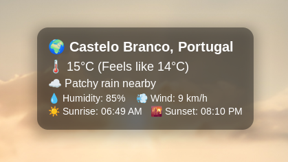
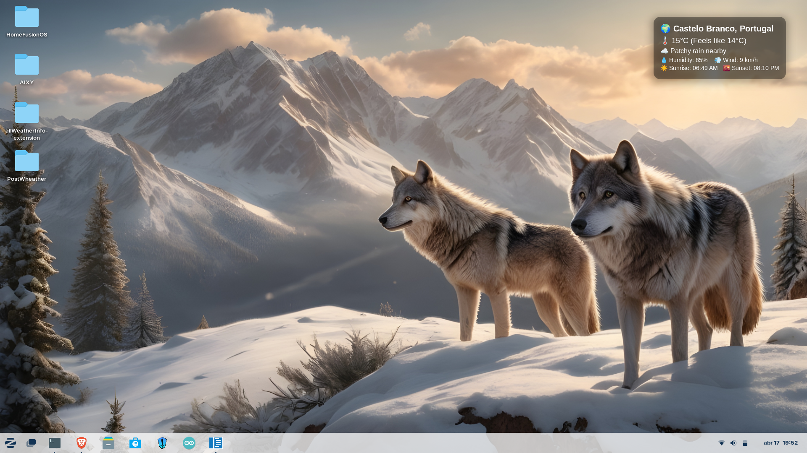

# 🌦️ allWeatherInfo GNOME Extension


**Author:** Pedro Lucas ([@pedrolucas7i](https://github.com/pedrolucas7i))  
**Description:** A sleek GNOME Shell extension that displays elegant, real-time weather information directly on your desktop.

---

## ✨ Features

- 📍 **Location-based Weather** (via your IP address)
- 🌡️ Temperature
- 🌡️ Feels like Temperature
- ☁️ Weather condition
- 💧 Humidity and 
- 🌬️ Wind speed
- ☀️ Sunrise time
- 🌇 Sunset time
- 📐 Clean and modern design with transparent background
- 🖥️ Non-intrusive — it displays directly on the desktop background, not over any windows

---

## 🛠️ Installation

### 1. Clone the Repository
```bash
git clone https://github.com/pedrolucas7i/allWeatherInfo-extension.git
cd allWeatherInfo-extension
```

### 2. Run the Installer
```bash
./install.sh
```

**The installer will:**
- ✅ Detect your Linux distribution
- 📦 Install required dependencies (`gnome-shell-extension-prefs`, `python3-pip`, etc.)
- 📁 Copy the extension to:
  ```
  ~/.local/share/gnome-shell/extensions/allWeatherInfo-extension@pedrolucas7i/
  ```
- 🐍 Ensure Python script is executable
- ⚙️ Install required Python module: `requests`
- ⚡ Enable the extension (automatically)

---

## 🚀 Activation

Depending on your session type:

- **X11 Users**:  
  Press `Alt` + `F2`, type `r`, then press `Enter` to restart GNOME Shell.

- **Wayland Users**:  
  Please **log out and log back in** to apply the changes.

Then launch the **Extensions** app or run:
```bash
gnome-extensions prefs
```
to manage or toggle the extension.

---

## 🧠 How It Works

1. 🌍 The extension uses the [ip-api.com](http://ip-api.com/) API to detect your location.
2. 🌤️ Then, it fetches weather data from [wttr.in](https://wttr.in) using that location.
3. 🐍 The Python script (`app.py`) handles all the data fetching.
4. 📦 The GNOME Shell extension displays the weather beautifully in the top-right corner of your screen.

---

## 📷 Screenshot



*Final result*

---

## 📄 License

MIT License – See `LICENSE` file for details.

---
